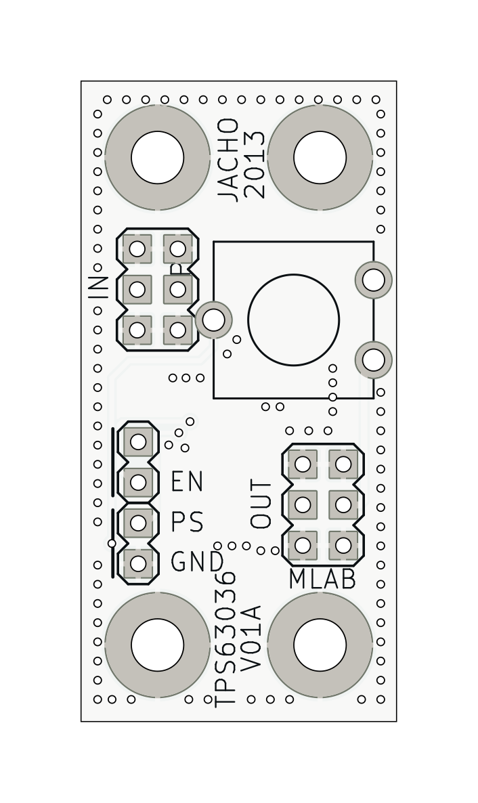
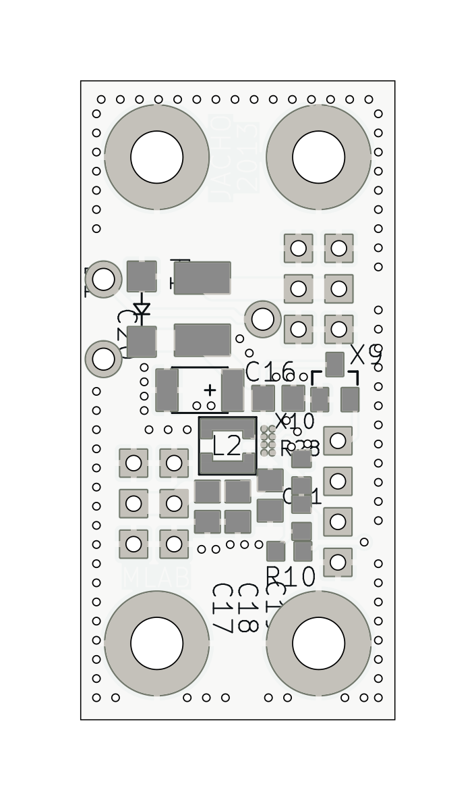

# TPS63036V01 -  TPS63036-Based  buck-boost converter 

The TPS63036V01 module is a highly efficient, single-inductor, buck-boost converter designed to provide a stable output voltage from varying input voltages. It integrates the Texas Instruments TPS63036 chip, making it suitable for applications requiring a compact, efficient power solution.

## Features

- **Input Voltage Range:** 1.8V to 5.5V
- **Output Voltage:** 3.3V (adjustable between 1.2V and 5.5V)
- **Maximum Output Current:** 600 mA
- **Operating Frequency:** 2 MHz
- **High Efficiency:** Up to 85% at 3.6V input and 500mA load
- **Compact Size:** Miniature 3.0 × 3.0 mm footprint
- **Shielded Inductors:** LPS3015 series for low DCR and excellent current handling

## Components

### TPS63036 Buck-Boost Converter
- **Manufacturer:** Texas Instruments
- **Package:** 8-ball, 1.854 mm × 1.076 mm wafer chip-scale package (YFG)
- **Description:** The TPS63036 is a highly efficient single-inductor buck-boost converter. It supports both fixed and adjustable output voltages. The device operates with an input voltage range of 1.8V to 5.5V.

### LPS3015 Series Shielded Inductors
- **Manufacturer:** Coilcraft
- **Inductance Values:** Range from 1.0 µH to 330 µH
- **DCR (max):** 0.075 to 23.0 ohms
- **Current Rating:** Up to 2.35A
- **SRF (min):** 9 MHz
- **Dimensions:** 3.0 × 3.0 mm footprint, less than 1.5 mm tall

## Setup Instructions

1. **Input Connection:** Connect the input power supply between on input header. Ensure the input voltage is between 1.8V and 5.5V.
2. **Output Connection:** Connect the load to output header.
3. **Enable/Disable:** Use jumper SV1 to enable or disable the TPS63036.
4. **Power-Saving Mode:** Use jumper SV6 to enable (PWM/PSM) or disable (PWM) the power-saving mode.

## Performance Specifications

| Parameter       | Condition                  | Min  | Typ  | Max  | Unit |
|-----------------|----------------------------|------|------|------|------|
| Input Voltage   |                            | 1.8  | 5.5  |      | V    |
| Output Voltage  | Vin = 4.2V, Iout = 500mA   | 3.2  | 3.3  | 3.4  | V    |
| Output Current  | Vin = 3.6V                 | 0    | 600  |      | mA   |
| Operating Freq. |                            |      | 2000 |      | kHz  |
| Efficiency      | 3.6V in, 500mA load        |      | 85   |      | %    |
| Output Ripple   | 3.6V in, 500mA load        |      | 25   |      | mV   |

## Additional Resources

- [TPS63036 Datasheet](https://www.ti.com/lit/ds/symlink/tps63036.pdf)
- [LPS3015 Inductor Datasheet](https://www.coilcraft.com/en-us/products/inductors/shielded/lps3015/)

## Contact

For support, contact MLAB at [support@mlab.cz](mailto:support@mlab.cz).

